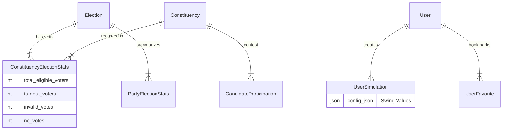

# การออกแบบฐานข้อมูลสำหรับ Political Analytics Platform (Jomsuksit) - Version 2 (Full Support)

เอกสารนี้ระบุโครงสร้างฐานข้อมูล (Database Schema) ที่อัปเดตเพิ่มเติมจากการวิเคราะห์ **Codebase** จริง (`types.ts`, `result.json`) เพื่อให้รองรับการแสดงผลหน้า Dashboard, การคำนวณ Swing Vote, และการเก็บข้อมูลสถิติการเลือกตั้งอย่างละเอียด

---

## 1. องค์ประกอบหลัก (Core Structures)

### 🔹 ภูมิศาสตร์ & พื้นที่ (Geography & Zones)

*โครงสร้างนี้รองรับการแสดงผลแผนที่และการแบ่งเขตรายภาค*

1.  **`regions` (ภูมิภาค)**
    *   `id`: PK (1=กลาง, 2=เหนือ, etc.)
    *   `name`: ชื่อภาค (e.g., "ภาคตะวันออกเฉียงเหนือ")
    *   `color_code`: สีประจำภาค (สำหรับการแสดงผลแผนที่)

2.  **`provinces` (จังหวัด)**
    *   `id`: PK
    *   `region_id`: FK -> (**regions**)
    *   `name`: ชื่อจังหวัด
    *   `code_name`: ชื่อภาษาอังกฤษ/รหัส (e.g., "bkk")
    *   `total_districts`: จำนวนเขตทั้งหมด (Cache)

3.  **`constituencies` (เขตเลือกตั้ง - Master)**
    *   *เก็บข้อมูลตัวเขต (เช่น เขต 1 เชียงใหม่)*
    *   `id`: PK
    *   `province_id`: FK -> (**provinces**)
    *   `district_number`: เลขเขต (1, 2, 3...)
    *   `name`: ชื่อเรียกพื้นที่ (e.g., "อำเภอเมือง (เฉพาะตำบล...)")
    *   `geojson_url`: ลิงก์ไฟล์ขอบเขตแผนที่ (สำหรับ Map Layer)

---

## 2. ข้อมูลการเลือกตั้ง & สถิติ (Election & Stats)

*ส่วนนี้เพิ่มเติมเข้ามาเพื่อรองรับไฟล์ `result.json` และการคำนวณ Turnout/Percent*

4.  **`elections` (รอบการเลือกตั้ง)**
    *   `id`: PK
    *   `year_th`: 2562, 2566, 2569
    *   `election_date`: วันที่เลือกตั้ง
    *   `description`: e.g., "การเลือกตั้งทั่วไป พ.ศ. 2566"
    *   `is_active`: สถานะปัจจุบัน

5.  **`constituency_election_stats` (สถิติรายเขตตามปี)** **[NEW]**
    *   *ตารางใหม่: รองรับ `ElectionScores` และข้อมูลผู้มาใช้สิทธิ์รายเขต*
    *   `id`: PK
    *   `election_id`: FK
    *   `constituency_id`: FK
    *   `total_eligible_voters`: ผู้มีสิทธิ์เลือกตั้งทั้งหมด
    *   `turnout_voters`: ผู้มาใช้สิทธิ์ (บัตรดี+เสีย+โหวตโน)
    *   `invalid_votes`: บัตรเสีย
    *   `no_votes`: โหวตโน (ไม่ประสงค์ลงคะแนน)
    *   *ประโยชน์*: ใช้คำนวณ % turnout และแสดงกราฟวงกลมสรุปผลการลงคะแนนของเขตนั้นๆ

6.  **`party_election_stats` (สรุปคะแนนพรรครายปี)**
    *   *รองรับ `PartyStats` ใน codebase*
    *   `id`: PK
    *   `election_id`: FK
    *   `party_id`: FK
    *   `total_votes`: คะแนนมหาชนรวม (Popular Vote)
    *   `constituency_seats`: จำนวน สส. เขตที่ได้
    *   `partylist_seats`: จำนวน สส. บัญชีรายชื่อที่ได้
    *   `total_seats`: รวมที่นั่งทั้งหมด

---

## 3. ผู้สมัคร & ผลคะแนน (Candidates & Results)

7.  **`parties` (พรรคการเมือง)**
    *   *รองรับประวัติการยุบพรรค/เปลี่ยนชื่อ*
    *   `id`: PK
    *   `name`: ชื่อพรรค (e.g., "พรรคอนาคตใหม่", "พรรคก้าวไกล")
    *   `short_name`: ชื่อย่อ
    *   `color`: รหัสสี
    *   `logo_url`: รูปโลโก้
    *   `status`: ENUM ('ACTIVE', 'DISSOLVED', 'MERGED') **[NEW]**
    *   `established_date`: วันที่ก่อตั้ง
    *   `dissolved_date`: วันที่ยุบพรรค (ถ้ามี) **[NEW]**
    *   `successor_party_id`: FK -> (**parties**) พรรคที่รับช่วงต่อ (e.g., อนาคตใหม่ -> ก้าวไกล) **[NEW]**
    *   *Note*: สามารถใช้ Recursive Query เพื่อหา lineage ของพรรคได้ (อนาคตใหม่ -> ก้าวไกล -> ประชาชน)

8.  **`people` (ทะเบียนบุคคล)**
    *   `id`: PK
    *   `prefix`: คำนำหน้า (นาย, นาง, ดร., พล.ต.อ.)
    *   `first_name`: ชื่อจริง
    *   `last_name`: นามสกุล
    *   `nickname`: ชื่อเล่น (ใช้ในการ Search)
    *   `birth_date`: วันเกิด (คำนวณอายุ)
    *   `gender`: เพศ
    *   `education`: ประวัติการศึกษา (JSONB)
    *   `ex_occupation`: อาชีพเดิม

9.  **`candidate_participations` (ลงสมัคร)**
    *   *รองรับ `Candidate` interface และการย้ายพรรค*
    *   `id`: PK
    *   `election_id`: FK
    *   `person_id`: FK -> (**people**)
    *   `party_id`: FK -> (**parties**)
    *   `constituency_id`: FK (Null ถ้าเป็นปาร์ตี้ลิสต์)
    *   `candidate_type`: 'CONSTITUENCY' | 'PARTY_LIST' | 'PM'
    *   `candidate_no`: เบอร์ผู้สมัคร
    *   `list_order`: ลำดับบัญชีรายชื่อ
    *   `score`: คะแนนที่ได้ (**สำคัญมากใช้วิเคราะห์ผล**)
    *   `is_winner`: ชนะหรือไม่
    *   `status`: สถานะ (ปกติ, ใบแดง, ใบส้ม)

---

## 4. การวิเคราะห์เชิงลึก (Advanced Analytics Support)

*ส่วนนี้เพิ่มเพื่อรองรับฟีเจอร์ "War Room" และ "Candidate Deep Dive"*

10. **`political_groups` (กลุ่มก้อน/มุ้ง)**
    *   *รองรับ Political Analytics*
    *   `id`: PK
    *   `name`: ชื่อกลุ่ม (Group Name) e.g., "บ้านใหญ่ชลบุรี"
    *   `influence_area`: พื้นที่อิทธิพล (Text)

11. **`political_relationships` (ความสัมพันธ์)**
    *   `id`: PK
    *   `person_id`: FK
    *   `group_id`: FK
    *   `role`: บทบาทในกลุ่ม (หัวหน้า, สมาชิก)

12. **`user_simulations` (บันทึกการจำลองผล)** **[NEW]**
    *   *รองรับฟีเจอร์ War Room ที่ให้ปรับ Swing Vote*
    *   `id`: PK
    *   `user_id`: FK (User ผู้ใช้งานระบบ)
    *   `name`: ชื่อ Scenario (e.g., "ถ้าเพื่อไทยแลนด์สไลด์")
    *   `config_json`: JSON เก็บค่า Swing ที่ปรับไว้ (e.g., `{ "party_swing": { "PT": +5, "MFP": -2 } }`)
    *   `created_at`: วันที่สร้าง

13. **`user_favorites` (Bookmark)** **[NEW]**
    *   *รองรับฟีเจอร์ "Fav คนที่น่าสนใจ"*
    *   `user_id`: UserId
    *   `person_id`: PersonId
    *   `note`: โน้ตช่วยจำส่วนตัว
    *   `created_at`: วันที่กด Fav

---

## 5. กระแสสังคม (Social Trends)

14. **`social_stats_daily` (สถิติโซเชียลรายวัน)**
    *   *รองรับกราฟ Trend*
    *   `id`: PK
    *   `date`: วันที่เก็บข้อมูล
    *   `person_id`: FK (Nullable)
    *   `party_id`: FK (Nullable)
    *   `platform`: 'FB' | 'TWITTER' | 'TIKTOK'
    *   `followers`: ยอดผู้ติดตาม
    *   `engagement`: ยอด Enagagement รวม
    *   `mentions`: จำนวนการถูกพูดถึงในโซเชียล

---

## แผนภาพความสัมพันธ์ที่เพิ่มขึ้น (Updated Schema)

โครงสร้างนี้ครอบคลุม:
1.  **Frontend Display**: มี `color`, `score`, `is_winner` ครบตาม UI
2.  **Calculation**: มี `eligible_voters` ใช้คำนวณ % Turnout `(turnout/eligible)*100`
3.  **Analysis**: มี `people` แยกจาก `participation` ทำให้ดูประวัติย้ายพรรคได้
4.  **War Room**: มี `user_simulations` เก็บการตั้งค่าจำลองผล
